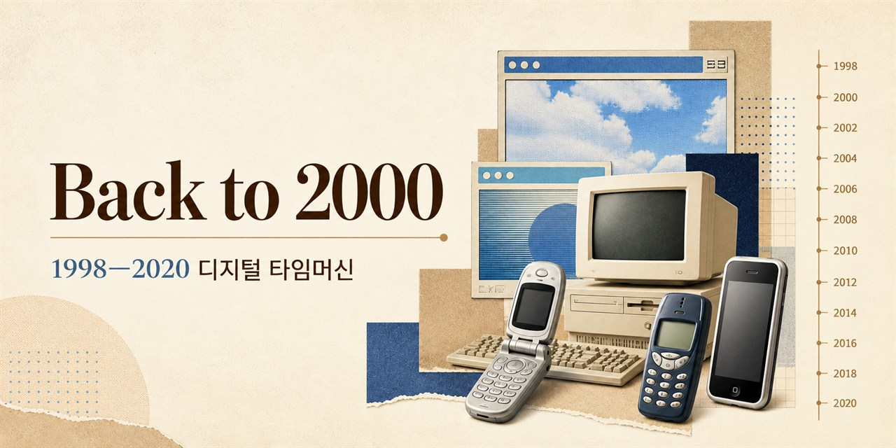

# Back to 2000

> 1998년부터 2020년까지 한국의 인터넷, 휴대전화, 게임 문화를 탐험하는 인터랙티브 디지털 아카이브입니다.
>
> An interactive digital archive of Korean internet, mobile, and game culture from 1998 to 2020.

[**라이브 데모 · Live demo**](https://backto2000.cloud) · [변경 기록](CHANGELOG.md) · [운영·복구 안내](docs/OPERATIONS.md) · [로드맵](docs/ROADMAP.md)



현재 버전 **0.4.5** · 공개 기록 **278개** · 대상 연도 **1998–2020**

연도를 고르면 그 시절의 웹사이트, 온라인 서비스, 휴대전화, 디지털 제품과 게임을 이미지와 이야기로 돌아볼 수 있습니다. 기억나는 항목이 빠졌거나 기록을 바로잡고 싶다면 [Issue](https://github.com/Dotoryman/Back-to-2000/issues)를 남겨주세요.

> 이 아카이브가 즐거웠거나 다시 찾아보고 싶다면 GitHub Star로 저장해 주세요.

## 주요 기능

- 연도별 웹사이트, 온라인 서비스, 휴대전화, 디지털 제품과 게임 탐색
- D1 기반 개인 추억 컬렉션과 계정별 보관 기능
- 전체 공개 기록의 검수 상태와 이미지 품질 점검
- 편집자·관리자 역할을 분리한 운영 스튜디오
- D1 백업, 격리 복원 검증, 장애 대응을 포함한 운영 절차

## English overview

- Browse **278 curated records** across the years 1998–2020.
- Explore websites, online services, mobile phones, digital products, and games through an image-led timeline.
- Save personal memories and reactions in a Cloudflare D1-backed collection.
- Study a production-oriented React and Cloudflare Workers project with documented backup and recovery procedures.

Try the [live archive](https://backto2000.cloud). If it helps your research or brings back a memory, consider starring the repository so you can find it again.

## 기술 스택

- **프런트엔드:** React 19, TypeScript, Vite, vinext, Framer Motion
- **백엔드:** Cloudflare Workers, Hono, Zod
- **데이터:** Cloudflare D1, R2, Drizzle ORM
- **운영:** Wrangler, Cloudflare Observability

## 로컬 개발

필수 환경은 Node.js 22.13 이상입니다.

```bash
npm install
npm run dev
```

주요 품질 검사는 다음 명령으로 실행합니다.

```bash
npm test
npm run lint
npm run quality:catalog
npm run quality:images
```

## Cloudflare 운영

운영 환경은 `wrangler.production.jsonc`의 `DB`(D1)와 `MEDIA`(R2) 바인딩을 사용합니다.

```bash
npm run cloudflare:backup
npm run cloudflare:verify-backup
npm run cloudflare:migrate
npm run cloudflare:deploy
```

백업과 격리 복원, 배포 후 확인, 장애 대응 절차는 [운영·복구 안내](docs/OPERATIONS.md)를 따릅니다. 비밀번호 pepper는 Worker secret `AUTH_PEPPER`로만 관리합니다.

## 프로젝트 구조

```text
app/             애플리케이션 화면과 라우트
components/      재사용 UI 컴포넌트
db/              D1 및 Drizzle 데이터 계층
domain/          도메인 모델과 규칙
worker/          Cloudflare Worker 진입점
tests/           자동화 테스트
docs/            운영, 복구, 로드맵 문서
```

## 문서

- [변경 기록](CHANGELOG.md): 버전별 변경 사항
- [운영·복구 안내](docs/OPERATIONS.md): 백업, 복원, 배포, 장애 대응
- [로드맵](docs/ROADMAP.md): 다음 개선 계획

## 라이선스

직접 작성한 소스 코드는 [MIT License](LICENSE)로 공개합니다. 저장소의 제3자 이미지, 로고, 상표, 스크린샷, 아카이브 자료와 편집 콘텐츠에는 MIT License가 적용되지 않으며 각 권리자와 출처의 조건을 따릅니다.

과거 버전의 상세 변경 사항은 [CHANGELOG.md](CHANGELOG.md)에서 확인할 수 있습니다...
